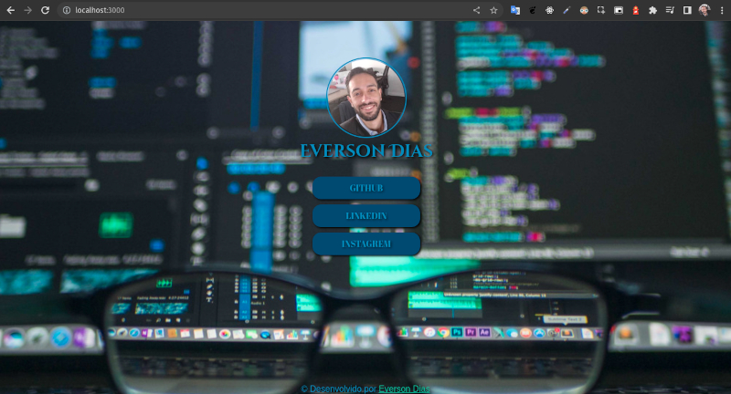

# MultLinks




# Tecnologias utilizadas


# Índice

* [Título e Imagens Home](#multlinks)
* [tecnologias utilizadas](#tecnologias-utilizadas)
* [Índice](#índice)
* [Descrição do projeto](#descrição-do-projeto)
* [Status do Projeto](#status-do-projeto)
* [Funcionalidade do projeto](#🔨-funcionalidade-do-projeto)
* [Acesso ao Projeto](#acesso-ao-projeto)
* [Teste de velocidade](#teste-de-velocidade)

# Descrição do Projeto

Esse projeto é um cartão de visita online onde é possível adicionar links como de rede social, landing page e outros. 


# Status do Projeto

> 💹 Alpha 💹

# 🔨 Funcionalidade do projeto

- acessar os links disponibilizado das minhas redes sociais

# Acesso ao projeto

você precisa ter Instalado o npm e o nodejs.

1° Clone o Projeto

```bash
git clone git@github.com:EversonDias/MultLinks.git
```

2° Entre no projeto

```bash
cd MultLinks
```

3° inicie o projeto

```bash
npx live-server
```
você tera uma resposta parecida com isso

```bash
Serving "/home/diasdev/my-projects/MultLinks" at http://127.0.0.1:8080
Ready for changes
```

a aplicação estará aberta nesta rota

```bash
http://127.0.0.1:8080
```


ou acesse através do link

* [site](https://eversondias.github.io/MultLinks/)

## teste de velocidade

<hr>

